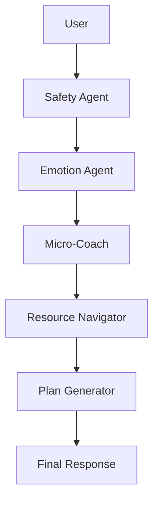

### 🧠 MindCompass — Multi-Agent Well-Being Resource Navigator & Micro-Coach
A safe, non-diagnostic, multi-agent well-being assistant designed to help users navigate emotional overwhelm, stress, low focus, or everyday struggles—while staying ethical, resource-oriented, and safety-compliant.

MindCompass is built using multi-agent orchestration, lightweight memory, and an optional Gradio/Streamlit chat UI.

---

## ⭐ Why MindCompass?
People dealing with stress or emotional overwhelm often struggle to find trustworthy well-being resources or actionable steps quickly.

MindCompass provides:

🧭 Emotion detection

💬 Safe micro-coaching actions

🌱 Personalized 7-day mini well-being plans

🔗 Trusted “resources-only” mental-health navigation

🛡️ Crisis detection & safety guardrails (no therapy, diagnosis, or medical advice)

----
### 🧩 Multi-Agent Architecture

MindCompass uses a structured orchestration:

